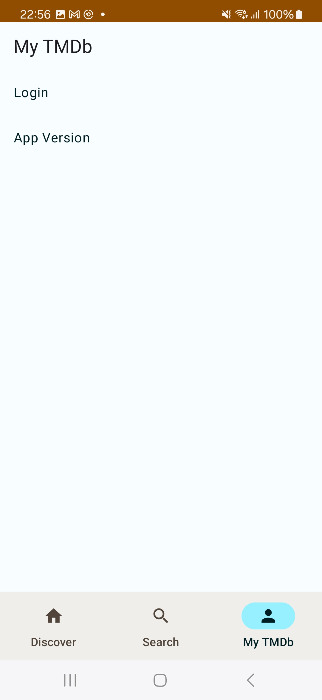
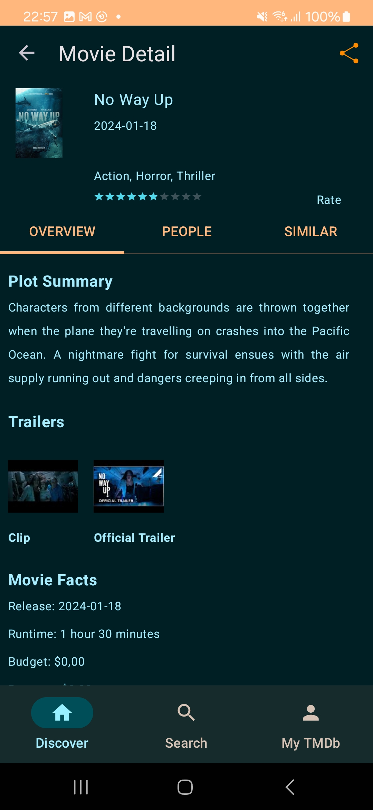

# Cineast_android

  

Cineast is an android app querying [TMDb API](https://developers.themoviedb.org/3/getting-started/introduction) to provide information on popular, trending, upcoming, top rated movies and popular actors. Cineast comes in with sharing, searching features, when signed in a user can add movies to their Favorites and  watch lists or rate them.  

## Prerequisites

  #### 1. Obtain Key
  
   Create an account with TMDB to obtain an API key.  
   
  #### 2. Configure gradle.properties  
  
  On obtention of your TMDB key, you will need to add it to a global gradle.properties file so as not to add it to version     control and expose your key and configure the projects app module build.gradle to reflect the name you gave your API Key. To add the newly obtained key to a global gradle.properties: 
   - In the roots folder of the project,  add a txt file named `apikeys.properties` 
   - then inside the file add a property `api_key = TMDb API KEY`. 
   
 On completion of the above steps, the app will be able to pick up your TMDb API KEY.

## Clean Architecture
This Application makes use of clean Architecture, hence the project is divided into the following packages:

- `Cache module`: uses [Room ORM](https://developer.android.com/training/data-storage/room) and [SharedPreferences](https://developer.android.com/reference/android/content/SharedPreferences) (to be updated in the future, to use [DataStore](https://developer.android.com/topic/libraries/architecture/datastore)) to store data locally.
- `Remote module`: uses [Retrofit](https://square.github.io/retrofit/) and [Coroutines](https://kotlinlang.org/docs/coroutines-overview.html) to make api calls. 
- `Data module`: an intermediate layer between the `Cache module`/`Remote module` and the `Domain module`.
- `Domain module`: nuclear module of the app, contains business logic and is written in [Kotlin](https://kotlinlang.org/). It doesn't have any external dependencies. 
- `Presentation module` : uses [JetPack Compose](https://developer.android.com/jetpack/compose) to build different UI components with [Material 3 design system](https://developer.android.com/jetpack/compose/designsystems/material3). 

For more details on Clean Architecture, check out the following links:

https://blog.cleancoder.com/uncle-bob/2012/08/13/the-clean-architecture.html

https://github.com/LostInIreland/Flutter-Clean-Architecture

https://github.com/bufferapp/android-clean-architecture-boilerplate
 
This [blog post](https://proandroiddev.com/build-a-modular-android-app-architecture-25342d99de82) explains the basics of modularization and its benefits. 

## Architecture Pattern

This app uses the MVVM architecture. 

## Async/Background Operations
Coroutines are used for async/background. This [blog post](https://medium.com/androiddevelopers/coroutines-on-android-part-i-getting-the-background-3e0e54d20bb) explains the basics of Coroutines in kotlin.   
 
## Screenshots

### Light Mode
   
   
   
  

### Dark Mode

              

## Libraries Used

[JetPack Compose](https://developer.android.com/jetpack/compose) - UI Library

[Material 3](https://developer.android.com/jetpack/compose/designsystems/material3) - Design system

[Hilt](https://developer.android.com/training/dependency-injection/hilt-android) - Dependency Injection Library

[Coroutines](https://kotlinlang.org/docs/coroutines-overview.html) - Coroutines

[Coil](https://coil-kt.github.io/coil/compose/) - Image Loading Library

[Retrofit](https://square.github.io/retrofit/) - Http Client for Api Calls

[Gson](https://github.com/google/gson) - Serialization/Deserialization Library

[Okhttp](https://github.com/square/okhttp) - An HTTP+HTTP/2 client for Android

[Room ORM](https://developer.android.com/training/data-storage/room) - Local Database

[Leak Canary](https://github.com/square/leakcanary) - Capture Memory Leaks
